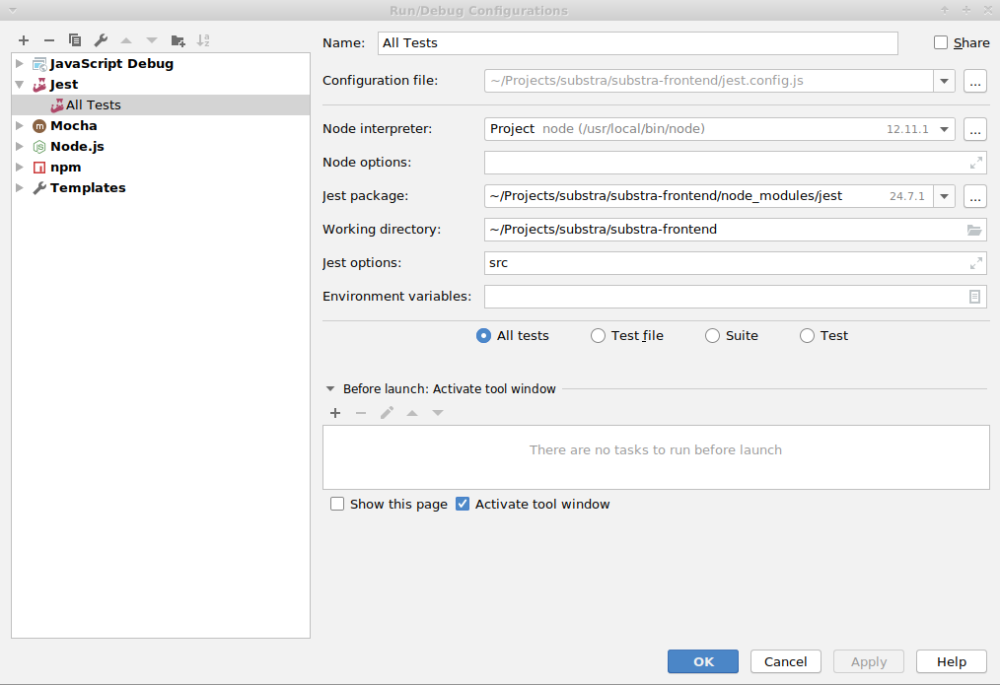

# Substra Frontend

## Installation

This project use yarn and the experimental yarn workspaces for package.json splitting and convenience.

Please install the last version of yarn and run:<br/>
`yarn config set workspaces-experimental true`

Then run:<br/>
`yarn install`

You also need a redis server on your machine.<br/>
On linux, simple run:<br/>
`sudo apt install redis`

And make sure the redis server is running by executing:<br/>
`redis-cli`


For testing and developing on the projet with true hot module replacement, run
`yarn start`

For testing with prod config:<br/>
`yarn start:prod`

For testing in electron, run:<br/>
`yarn dev`

For packaging for electron:
```
yarn build:electron
yarn build-electron
yarn package-all
```

For building the production website and deploy it, run:
Before deploying, create a file deploy.js in the tools folder with your param:
```
yarn build:main
yarn deploy
```

You can now stop the task on aws ECS, it will restart automatically, if you did not define an autoscaling policy.

Do no forget to invalidate the cache on your aws redis instance.
Connect with ssh to your ec2 instance, then connect to your redis instance as explain in elasticache documentation.
https://docs.aws.amazon.com/AmazonElastiCache/latest/UserGuide/GettingStarted.ConnectToCacheNode.html#GettingStarted.ConnectToCacheNode.Redis.NoEncrypt
Then run `flushall`. You should automatize this part.
More information in the cache part below.

## Docker launch

The `docker-compose.yaml` file will launch substra-frontend and redis docker instances.
substra-frontend will be launch with prod settings, which is a bit different from the settings.
Launch it with:
```bash
$> docker-compose up -d --force-recreate
```

If you want to update the docker images, execute:
```bash
$> docker-compose up -d --force-recreate --build
```

If your substra-backend instance use basicauth settings, you need to pass the `BACK_AUTH_USER` and `BACK_AUTH_PASSWORD` variables to your current environment for not triggering 403 responses.


## Substra-UI

This project depends on [https://github.com/SubstraFoundation/substra-ui](substra-ui) for some of its components.
If you need to add/move a component to substra-ui and need to test its integration within
substra-frontend, you'll need to "link" substra-ui:

In the substra-ui directory:

```sh
yarn link
```

In the substra-frontend directory:

```sh
yarn link @substrafoundation/substra-ui
```

Your local built version of substra-ui will be the one used by your
local substra-frontend. In order to automatically rebuild substra-ui at each
change, do:

In the substra-ui directory:

```sh
yarn build --watch
```

## Generate static for github pages

Simply run `npm run static` for generating a `static` folder and an `index.html` file a the root of the project.

You can also run `npm run static-debug` for debugging it in localhost with Webstorm.

## Test and Cover

For running the test suite:
`yarn test`

For displaying covering:
`yarn cover`

If you are using Webstorm, you can use the jest configuration for easily debugging your tests with breakpoints:


## Eslint

For displaying lint errors:
`yarn eslint`

## Cache

This project use a redis cache manager for the server routes. Allowing us not to rerender the same html production by route.
For deploying with amazon, please create a redis cluster by following this documentation:
https://docs.aws.amazon.com/AmazonElastiCache/latest/UserGuide/GettingStarted.CreateCluster.html
Don't forget to create a isolated security group for opening port 6379 as described in the documentation.

### test
For testing your generated docker with your localhosted redis, update your `deploy.js` file and do not forget to comment the part that push to your registry, then:
```shell
$> redis-cli flushall && docker run -it -v /etc/letsencrypt/:/etc/letsencrypt/ --net="host" -p 8000:8000 docker_image_name:latest
```

You'll notice I also bind the let's encrypt folder, more information in the next part.

Then head to https://localhost:8001/

Do not forget to `redis-cli flushall` when testing multiple times.

Disable redis for testing this project in ssl with `-p 8001:8443`.

## Encryption files creation

For creating your own self signed certificates

https://blog.didierstevens.com/2008/12/30/howto-make-your-own-cert-with-openssl/
```shell
cd encryption
openssl genrsa -out ca.key 4096
openssl req -new -x509 -days 1826 -key ca.key -out ca.crt
openssl genrsa -out ia.key 4096
openssl req -new -key ia.key -out ia.csr
openssl x509 -req -days 730 -in ia.csr -CA ca.crt -CAkey ca.key -set_serial 01 -out ia.crt
```


#### With let's encrypt

##### Dev mode

```shell
sudo certbot certonly --manual -d substraFoudation.github.io -d www.substraFoudation.github.io
```

Places the files in the folder `./well-known/acme-challenge` and build and deploy your website, then continue the process for validating the ownership of the website.
Then places the generated files to the `encryption` folder.

The certificates will only last for 90 days, so be sure to create a cronjob with the command
```shell
sudo certbot renew
```
for issuing new certificates and rebuild and deploy your docker app.

## Debugging with JetBrains editors

In order to debug your code within a JetBrains editor you'll need to:

1. Run your code in dev mode,
2. Setup a "Javascript debug" configuration in the editor. Use the URL at which your dev server is accessible for the URL field,
3. Run this new configuration in debug mode.
4. You're done!

This will open a new browser window that will respond to your breakpoints.

*Taken from https://blog.jetbrains.com/webstorm/2017/01/debugging-react-apps/*
